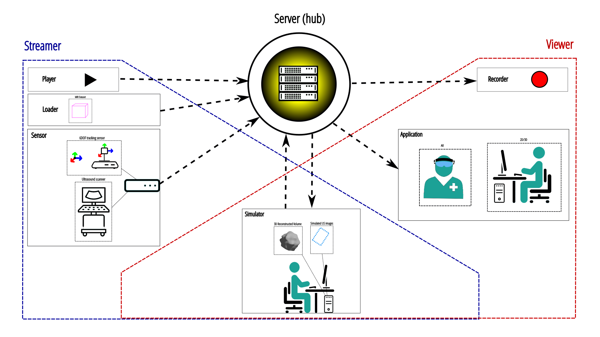

Why use it ?
============

This library allows the abstraction of the different data acquired by sensors
using different manufactor drivers.
You can write processing/visualising applications without worrying about the acquisition part.
It is a reusable and modular system.
It also allows several machines to work on the same data in real time.

.. Todo change image

